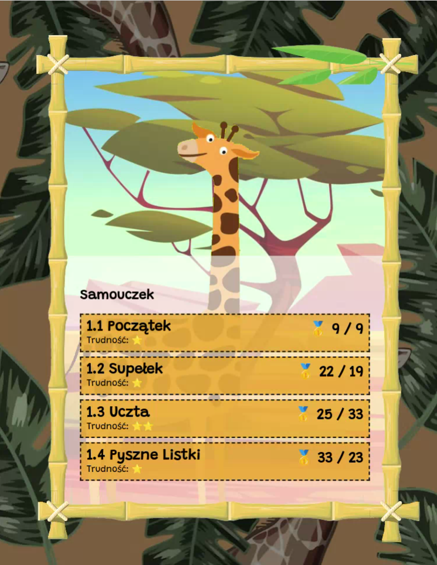
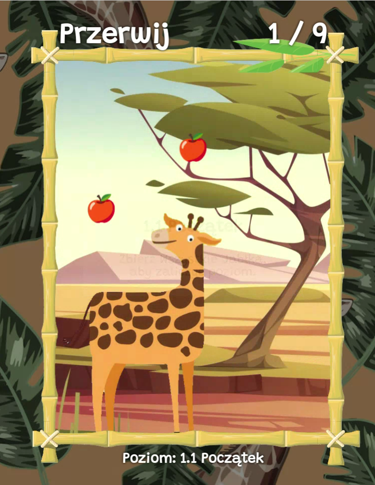
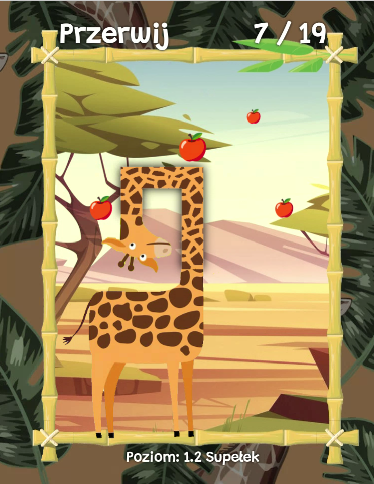
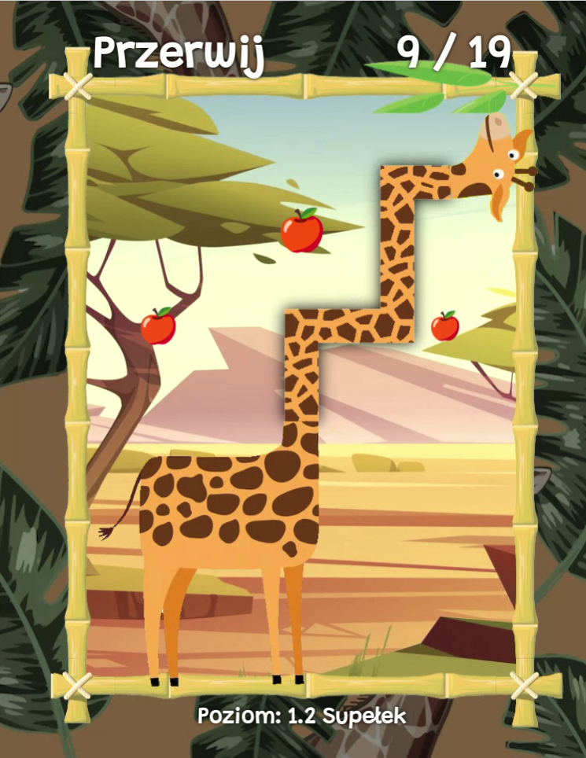

# 🦒ŻyrafoWąż
W grze wcielamy się w żyrafę z bardzo długą szyją, która stara się zdobyć wszystkie smakołyki rosnąć na drzewie (jabłka, liście). 
Musi przytym uważać aby się nie zaplątać.

Gra jest grą typowo logiczną zręcznościową, w której musimy tak pokierować 

## Technologia:
Gra została wykonana w technologi webowej z użyciem JavaScriptu. Powinna działać w większości przeglądarek webowych.

## Sterowanie:
- Menu: Myszka
- W trakcie gry: klawisze WSAD

### Team: RPM
- Paweł Kubiak
- Marek Ciążyński
- Rafał Paprocki

## Screenshots

 

## Gameplay

## Used Assets
Downloaded from FreePik using personal license:

- [giraffe](https://www.freepik.com/free-vector/flat-zoo-animals-composition-with-buffalo-leopard-snake-squirrel-penguin-turtle-giraffe-flamingo-crocodile-peacock-raccoon-monkey-boar-lion-illustration_12986837.htm)
- [background](https://www.freepik.com/free-vector/hand-drawn-realistic-tropical-plants-animals-background_4592962.htm)
- [border](https://www.freepik.com/premium-vector/square-bamboo-frame-blank-pattern-summer-single-vector-object_21100273.htm)
- [leaves](https://www.freepik.com/free-vector/floating-falling-green-leaves-background-design-with-copyspace_9727949.htm)
- [menu / levels background](https://www.freepik.com/free-vector/african-savannah-landscape-wild-nature-africa_21267432.htm)
- [apple](https://www.freepik.com/premium-vector/red-apple-shiny-fresh-fruit-delicious-snack_22142637.htm)

# 